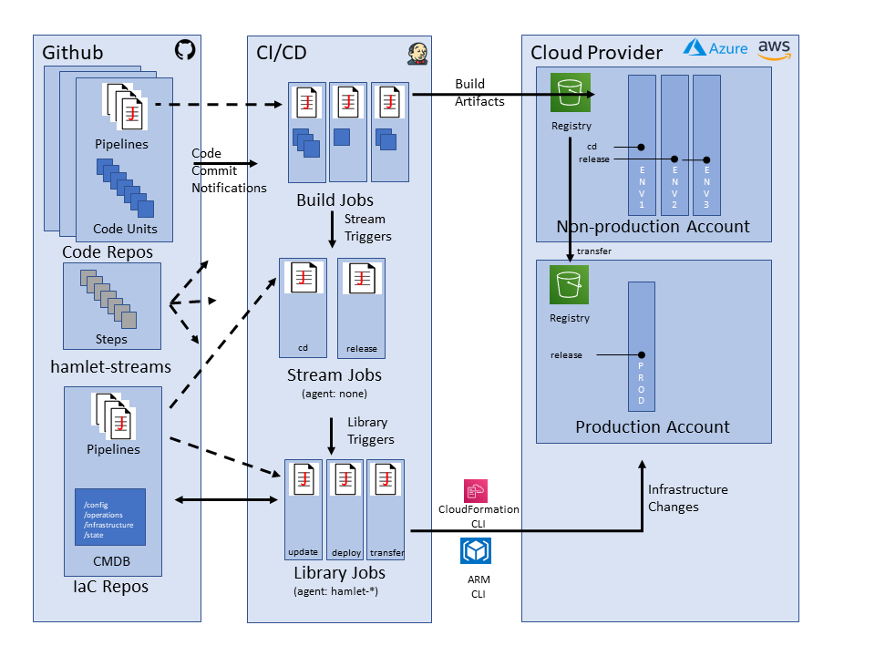

# hamlet-streams

This repo provides a range of support steps and examples to assist in the use of Jenkinsfiles to implement a deployment convention called "streams".

## Concept

The streams convention identifies three uses of Jenkins pipeline based jobs - build, stream, and library. As shown below;

### Build Jobs

Build jobs know how to build things and package them into artifacts, in line with the "build once, deploy many" philosophy. They store the artifacts in registries, where they can be then be sourced by downstream deployment processes.

Following successful build/test activities, build jobs know what "stream" to inject the build results into depending on the build trigger condition. However builds know nothing of environments as such.

They use the Jenkins multi-branch pipeline plugin to permit a variety of development practices including the use of pull requests and tagging.

### Stream jobs

Stream jobs define the deployment journey of the results of a build job through environments. In the overview diagram, two examples are shown. `cd` is the continuous stream which automatically deploys any changes to `ENV1`. `release` is a managed stream, with changes progressing through `ENV2`, `ENV3` and `PROD`. The transition from `ENV3` to `PROD` involves different accounts/subscriptions from the cloud provider.

Each environment can have an entry and exit "gate", which define the actions needed for builds to be deployed into an environment (entry) and for the builds to be considered suitable to proceed to the next environment (exit). Depending on the conditions included in the gates, a variety of deployment patterns, including continuous deployment and managed releases, can be implemented.

Streams use the standard pipeline plugin and are designed to work with `agent none`, meaning they run on the lightweight executor and thus don't consume resources while waiting for user input - a typical condition used in a gate. They thus rely on triggering other library jobs to do the actual work of the deployment. They represent the desired release process with the concrete implementation being deferred to library jobs.

The streams convention provides a nice separation between the CI part of the world controlled via a Jenkinsfile in a code repo, and the CD part of the world controlled by a Jenkinsfile kept in the hamlet IaC repo. Developers are in full control of what happens in their builds, while the change management folks worry about the desired processes to get the code through environments into production.

### Library Jobs

Library jobs use the standard pipline plugin and are where the actions needed by a stream are implemented. They result in changes to cloud deployments and update to the IaC stores used to manage the desired and actual states of environments.

Library jobs are the point at which a specific IaC framework must be selected. Currently this repo contains [examples](examples) for the hamletDeploy framework. By isolating details of how to invoke a particular IaC framework, stream designers can focus on processes without needing to understand the intricate details of the specific framework used.

Each library job provides a reusable building block for stream designers.

## Library Blocks

The library job examples in this repository provide the library blocks below.

### Plan

It is often desirable to see what changes would result in IaC artifacts if the entry gate for a particular environment was confirmed. The changes can then be reviewed before the gate is actually accepted.

The Plan block creates a temporary branch in the IaC repo and then applies the changes that would be applied if a gate were confirmed. It captures the results of this "whatif" processing in the temporary branch.

### Update

The Update block records details of the code builds provided to the stream in the IaC repo. The particular builds currently employed in an environment are thus considered part of the config, so that the environment can be recreated in full at any time.

### Deploy

The Deploy block is responsible for taking the current (to be) state of the IaC repos and reflecting this the actual (as is) state of the environments within the cloud provider.

### Transfer

It is common to separate production environments in their own cloud account/subscription. In order for the production environment to be able to operate standalone, it is common to use a separate artifact registry for production. The Transfer block permits the transfer of build artifacts provided to a stream to be transferred between registries. It is only needed where stages in a stream transition between environments that are not co-located in the cloud provider e.g. the `release` stream in the overview diagram.

### Accept

The confirmation of the exit gate for an environment often needs to be recorded in change management systems for audit purposes. The Accept block thus permits details of who confirmed the exit gate, along with any test artifacts, to be forwarded to change management systems of record.

### Manage

The Manage block co-ordinates the creation of any infrastructure that may be required to be in place before application related changes can be deployed via stream jobs. While there is nothing in the design of the streams convention that says infrastructure can't be redeployed as part of a stream (via the Deploy block for instance), in general this is avoided as it increases the execution time of stream for no return.

## Jenkins pipeline steps

This repository is designed to be used as a Jenkins shared library to provide directly invocable step functions in pipelines. Each step is thus defined in its own file. Help for each step is provided in the corresponding `.txt` file, which also makes the help available under the "Pipeline Syntax -> Global Variable Reference" option of the menu shown when reviewing the pipeline job within the Jenkins server.

### General logging

The following steps provide a general mechanism to log the occurrence of various events within pipelines to one or more collaboration channels. The selection
of the channels is left as a task for the calling pipeline.

- notifyChannels
- notifyFailure
- notifySuccess

### Build Jobs

The following steps are provided to streamline the development of build pipelines.

- buildOpenapi
- loadCMDB
- loadProperties
- notifyBuildFailure
- notifyBuildSuccess
- notifyQAFailure
- notifySetupFailure
- notifyTriggerStreamFailure
- runCITargets
- runCITargetWithNodeOptions
- setNodejsVersion
- triggerStream
- uploadArtifactsToRegistry

### Stream Jobs

The following steps are provided to streamline the development of stream pipelines.

- notifyEntryConfirmation
- notifyExitConfirmation
- triggerAccept
- triggerDeploy
- triggerManage
- triggerPlan
- triggerTransfer
- triggerUpdate

### Library Jobs

The following steps are provided to streamline the development of library pipelines.

- notifyAcceptFailure
- notifyAcceptSuccess
- notifyDeployFailure
- notifyDeploySuccess
- notifyManageFailure
- notifyManageSuccess
- notifyPlanDeployFailure
- notifyPlanUpdateFailure
- notifyTransferFailure
- notifyTransferSuccess
- notifyUpdateFailure
- notifyUpdateSuccess
